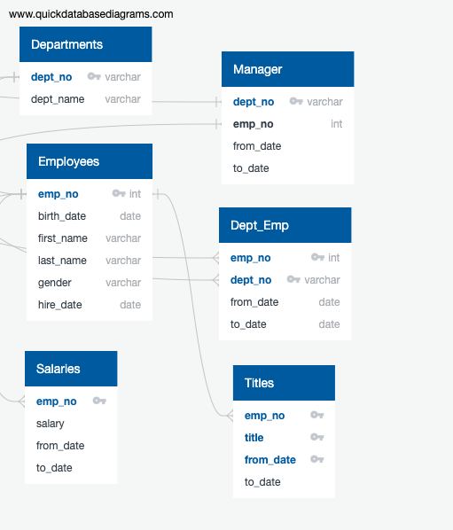

# Pewlett-Hackward-Analysis.
 ## *Employee Database with SQL*

 ### *Project Overview*

 Bobby is an upcoming HR analyst at Pewlett Hackward company whose task is to perform employee research specifically, he needs to find answers to the following questions.

1) Who will be retiring in the next few years from the company? 

2) How many positions Pewlett Hackward will need to fill?

This analysis will help future proof Pewlett Hackward by generating a list of all employees eligible for the retirement package.
 
 The employee data bobby needs is only available in the form of six csv files because Pewlett Hackward has been mainly using Excel and VBA to work with their data. But now they finally decided to update their methods and instead use SQL.

The task for this project is to help bobby build an employee database with SQL by applying data modeling, engineering and analytical skills.  

### *Resources*

* Data Source: departments.csv, dept_manager.csv, employees.csv, dept_emp.csv, salaries.csv and titles.csv (present in the Data folder).
* Postgres - Database system for holding data.
* PgAdmin - Interface to talk to Postgres (All SQL actions take place here). 

## *Summary*

An entity relationship diagram was made to view the relationships between the six csv files. The ERD is the following:

 

Six different tables were created using PgAdmin that stored the desired data in them. Then different queries were performed using these six tables, each representing the above csv files. 

Bobby’s boss has determined that anyone born between 1952 and 1955 will begin to retire. To narrow the search for retirement elegiblity the query is to include a specific hiring range (between 1985 and 1988). 

The following queries were created throughout the module. 

 **A list of those employees who will be retiring soon:**

*SELECT emp_no, first_name, last_name
INTO retirement_info
FROM employees
WHERE birth_date BETWEEN '1952-01-01' AND '1955-12-31'
AND (hire_date BETWEEN '1985-01-01' AND '1988-12-31');*

**Inner join was used to join Departments and dept-manager Tables:**

*SELECT d.dept_name,
     dm.emp_no,
     dm.from_date,
     dm.to_date
FROM departments AS d
INNER JOIN dept_manager AS dm
ON d.dept_no = dm.dept_no;* 

**Left Join for retirement_info and dept_emp tables to get current employees who are eligible for retirement:**

*SELECT ri.emp_no,
     ri.first_name,
	 ri.last_name,
	 de.to_date
INTO current_emp
FROM retirement_info AS ri
LEFT JOIN dept_emp AS de
ON ri.emp_no = de.emp_no
WHERE de.to_date = ('9999-01-01');*

**Employee count by department number:**

*SELECT COUNT(ce.emp_no), de.dept_no
INTO employee_count
FROM current_emp AS ce
LEFT JOIN dept_emp AS de
ON ce.emp_no = de.emp_no
GROUP BY de.dept_no
ORDER BY de.dept_no;* 

**Employee Information:** A list of employees containing their unique employee  number, their last name, first name, gender, and salary: 

*SELECT e.emp_no,
	 e.first_name, 
	 e.last_name, 
	 e.gender, 
	 s.salary, 
	 de.to_date
INTO emp_info
FROM employees as e
INNER JOIN salaries AS s
ON (e.emp_no = s.emp_no)
INNER JOIN dept_emp AS de
ON (e.emp_no = de.emp_no)
WHERE (e.birth_date BETWEEN '1952-01-01' AND '1955-12-31')
AND (e.hire_date BETWEEN '1985-01-01' AND '1988-12-31')
AND (de.to_date = '9999-01-01');*

**Management:** A list of managers for each department, including the department number, name, and the manager’s employee number, last name,first name, and the starting and ending employment dates: 

*SELECT dm.dept_no,
     d.dept_name,
	 dm.emp_no,
	 ce.first_name, 
	 ce.last_name,
	 dm.from_date,
	 dm.to_date
INTO manager_info
FROM dept_manager AS dm
INNER JOIN departments AS d
     ON (dm.dept_no = d.dept_no)
INNER JOIN current_emp AS ce
     ON (dm.emp_no = ce.emp_no);*

**Department Retirees:** An updated current_emp list that includes everything it currently has, but also the employee’s departments:

*SELECT ce.emp_no,
	 ce.first_name,
	 ce.last_name,
	 d.dept_name
INTO dept_info
FROM current_emp AS ce
INNER JOIN dept_emp AS de
ON (ce.emp_no = de.emp_no)
INNER JOIN departments AS d
ON (d.dept_no = de.dept_no);* 

### *Results*

All the tables created by the above queries are present in the data folder. The following are the names of the tables in the form of csv files.

* retirement_info.csv
* current_emp.csv 
* employee_count.csv 
* emp_info.csv
* manager_info.csv
* dept_info.csv

### *Challenge Overview*

NOTE: The challenge.sql file resides in the Queries folder. 

The HR Director at Pewlett Hackward  would like an additional list of employees who would be good candidates for a supervisory role. Ideally, these candidates would be born in 1965.

**Number of [titles] Retiring:** Inner joins are performed on employees, titles and salaries tables since all the required information resided in these tables.The following query returns a tabel that contains all the required information:

*SELECT e.emp_no,
	 e.first_name,
	 e.last_name,
	 ti.title,
	 ti.from_date,
	 s.salary
INTO employees_retiring_info
FROM employees AS e
INNER JOIN titles AS ti
ON (e.emp_no = ti.emp_no)
INNER JOIN salaries AS s
ON (e.emp_no = s.emp_no)
WHERE (birth_date BETWEEN '1952-01-01' AND '1955-12-31')
AND (hire_date BETWEEN '1985-01-01' AND '1988-12-31');*

**Only the Most Recent Titles:** Exclude the rows of data containing duplicate names using data partitioning:

Find duplicate rows in the employees_retiring_info table.

*SELECT first_name, 
	 last_name,
	 COUNT(*)
FROM employees_retiring_info
GROUP BY
	 first_name,
	 last_name
HAVING count(*) >1;*

Get all the information for the duplicate rows in the employees_retiring_info table.

*SELECT * FROM 
	 (SELECT *, COUNT(*)
	 OVER (PARTITION BY
		  first_name,
		  last_name
		  )AS count
	 FROM employees_retiring_info) tableWithCount
	 WHERE tableWithCount.count >1;*

Delete unwanted duplicates in employees_retiring_info table.

*SELECT emp_no,
	 first_name,
	 last_name,
	 title,
	 from_date,
	 salary
INTO employees_duplicatefree_info
FROM ( SELECT emp_no,
	 first_name,
	 last_name,
	 title,
	 from_date,
	 salary,
	 ROW_NUMBER() OVER
	 (PARTITION BY (first_name, last_name) ORDER BY from_date DESC) rn
	  FROM employees_retiring_info
	 ) tmp WHERE rn = 1;*

**Get the frequency count of employee title:**

*SELECT title, 
COUNT(*) 
INTO titles_frequency
FROM employees_duplicatefree_info
GROUP BY title;*

**Employees who are ready to be mentors:** Inner join is performed on employees and titles tables since all the required information resided in these tables. To get the employees who will be ready to become a mentor the birth date needs to be between January 1, 1965 and December 31, 1965 for them.The following query returns a tabel that contains all the required information:

*SELECT e.emp_no,
	 e.first_name,
	 e.last_name,
	 ti.title,
	 ti.from_date,
	 ti.to_date
INTO mentors_info
FROM employees AS e
INNER JOIN titles AS ti
ON (e.emp_no = ti.emp_no)
WHERE (e.birth_date BETWEEN '1965-01-01' AND '1965-12-31')
AND (e.hire_date BETWEEN '1985-01-01' AND '1988-12-31')
AND (ti.to_date = '9999-01-01');* 

**Count the number of employees that are ready to be mentors:**

*SELECT COUNT(*) FROM mentors_info;*

## *Results*

All the tables created by the above queries are present in the data folder. The following are the names of the tables in the form of csv files. 

* employees_retiring_info.csv
* employees_duplicatefree_info.csv
* titles_frequency.csv
* mentors_info.csv

There are 691 employees who are ready to be mentors for the new hired people in the future at Pewlett Hackward.

